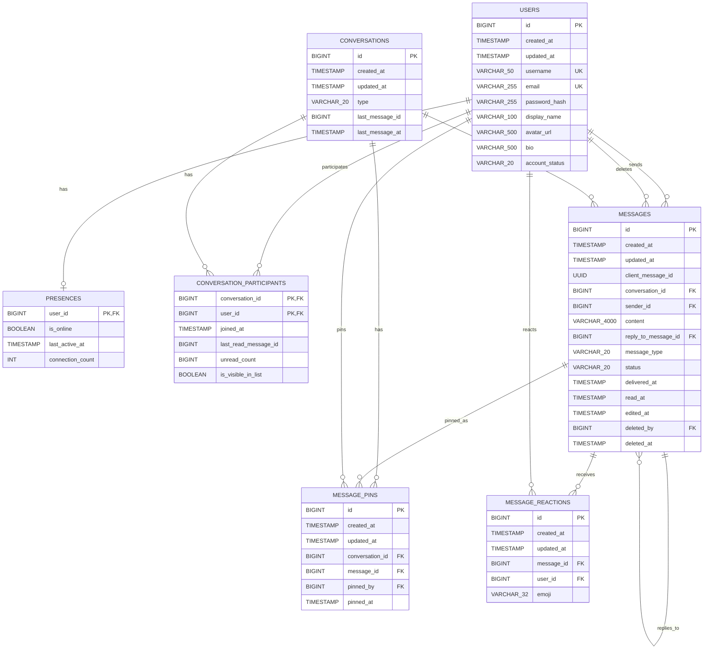

# Database ERD

Source: current JPA entities under `src/main/java/backend/xxx/chat`.

## Notes

- `conversation_participants` uses a composite primary key: `(conversation_id, user_id)`.
- `presences.user_id` is both the primary key and a foreign key to `users.id`.
- `messages` has a unique constraint on `(conversation_id, client_message_id)` to make client-side retry idempotency safe at the database layer.
- `conversations.last_message_id` and `conversation_participants.last_read_message_id` are plain `BIGINT` columns in the current JPA model. They are logical references to `messages.id`, but there is no `@ManyToOne` / `@JoinColumn`, so Hibernate will not create foreign key constraints for them.
- `messages.reply_to_message_id` is a nullable self-reference used for reply messages.
- Soft-deleted/unsent messages keep their row and original content in storage, but application responses should hide `content` when `deleted_at` is set.
- `message_pins` is separate from `messages` so pin metadata can track who pinned and when. The max pinned-message count per conversation should be enforced in application service logic.
- `message_reactions` uses `UNIQUE(message_id, user_id, emoji)` so one user cannot add the same emoji to the same message more than once.
- Enum columns are stored as strings:
  - `users.account_status`: `ACTIVE`, `INACTIVE`, `SUSPENDED`, `BANNED`
  - `conversations.type`: `DIRECT`
  - `messages.message_type`: `TEXT`
  - `messages.status`: `SENT`, `DELIVERED`, `READ`
  - `message_reactions.emoji`: `LIKE`, `LOVE`, `HAHA`, `WOW`, `SAD`, `ANGRY`
