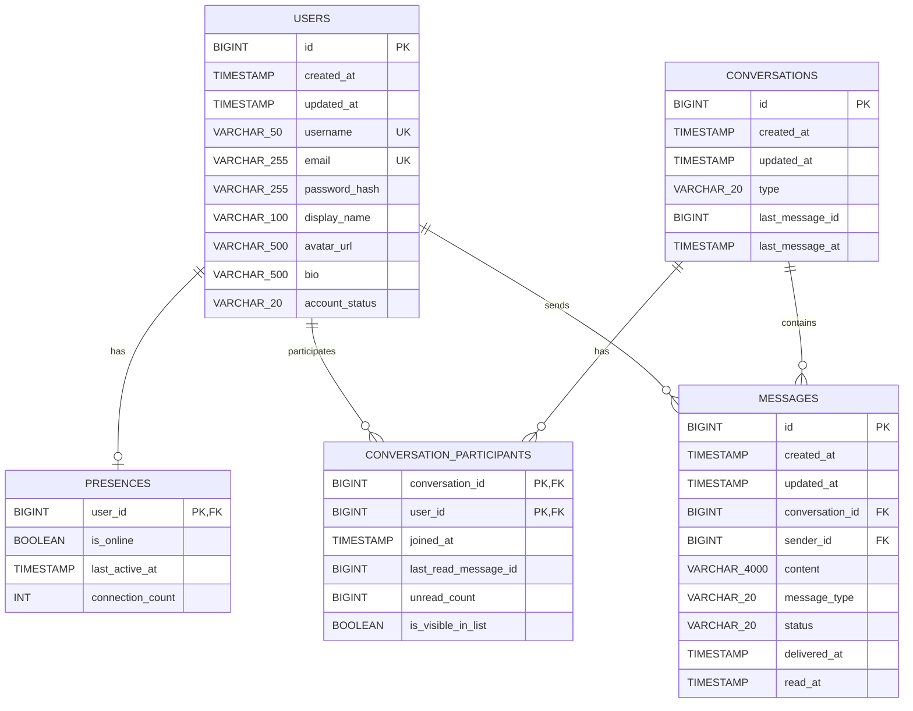

# Database ERD

Source: current JPA entities under `src/main/java/backend/xxx/chat`.

## Notes

- `conversation_participants` uses a composite primary key: `(conversation_id, user_id)`.
- `presences.user_id` is both the primary key and a foreign key to `users.id`.
- `conversations.last_message_id` and `conversation_participants.last_read_message_id` are plain `BIGINT` columns in the current JPA model. They are logical references to `messages.id`, but there is no `@ManyToOne` / `@JoinColumn`, so Hibernate will not create foreign key constraints for them.
- Enum columns are stored as strings:
  - `users.account_status`: `ACTIVE`, `INACTIVE`, `SUSPENDED`, `BANNED`
  - `conversations.type`: `DIRECT`
  - `messages.message_type`: `TEXT`
  - `messages.status`: `SENT`, `DELIVERED`, `READ`
