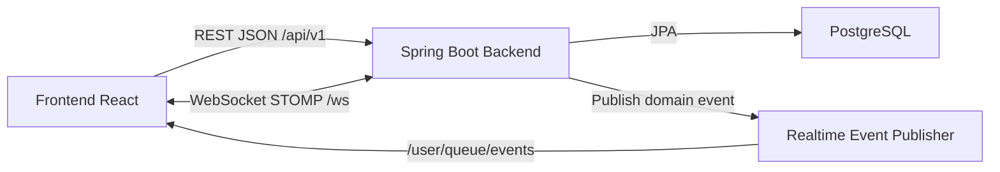
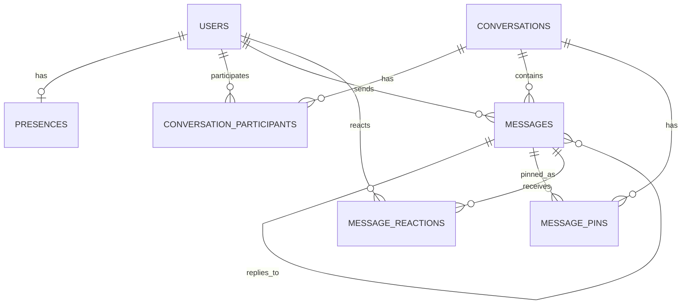

# Tài liệu đặc tả phần mềm - Ứng dụng Chat Realtime

## 1. Thông tin tài liệu

| Mục | Nội dung |
| --- | --- |
| Tên tài liệu | Đặc tả phần mềm cho ứng dụng Chat Realtime |
| Phiên bản | 1.0 |
| Ngày lập | 2026-05-20 |
| Trạng thái | Draft theo codebase hiện tại |
| Phạm vi | Frontend React/Vite và Backend Spring Boot của ứng dụng chat |
| Đối tượng đọc | Product Owner, BA, Developer, Tester, DevOps, UI/UX |

Tài liệu này đặc tả hệ thống chat realtime dựa trên cấu trúc mã nguồn hiện có, các tài liệu trong thư mục `docs`, OpenAPI REST và ERD hiện tại. Khi API, schema hoặc hành vi nghiệp vụ thay đổi, tài liệu này cần được cập nhật cùng lúc với mã nguồn.

## 2. Mục đích và phạm vi

Ứng dụng cung cấp nền tảng nhắn tin realtime giữa các người dùng đã đăng ký trong cùng hệ thống. Trọng tâm phiên bản hiện tại là hội thoại 1-1, tin nhắn văn bản, trạng thái realtime và các thao tác tin nhắn cơ bản.

### 2.1. Mục tiêu sản phẩm

- Cho phép người dùng đăng ký, đăng nhập và duy trì phiên bằng JWT.
- Cho phép người dùng tìm kiếm người dùng khác và bắt đầu hội thoại trực tiếp.
- Cho phép gửi, nhận, đọc và quản lý tin nhắn văn bản theo thời gian thực.
- Hiển thị trạng thái online/offline, đang nhập, đã nhận và đã đọc.
- Hỗ trợ các thao tác nâng cao trên tin nhắn: trả lời, sửa, xóa mềm, ghim và reaction.
- Cung cấp API REST và kênh WebSocket/STOMP rõ ràng để frontend và backend đồng bộ dữ liệu.

### 2.2. Trong phạm vi

- Xác thực: đăng ký, đăng nhập, refresh token.
- Hồ sơ cá nhân: xem và cập nhật tên hiển thị, avatar, bio.
- Tìm kiếm người dùng đang hoạt động.
- Tạo hoặc mở hội thoại 1-1.
- Danh sách hội thoại có phân trang cursor và snapshot.
- Lịch sử tin nhắn có phân trang cursor.
- Gửi tin nhắn text, trả lời tin nhắn.
- Sửa, xóa mềm, ghim/bỏ ghim và reaction tin nhắn.
- Đánh dấu đã nhận, đã đọc.
- Presence online/offline và typing indicator qua WebSocket.
- Giao diện web cho đăng nhập, đăng ký, chat và hồ sơ cá nhân.

### 2.3. Ngoài phạm vi hiện tại

- Group chat nhiều người.
- Upload ảnh, file, video hoặc voice message.
- Gọi audio/video.
- Push notification ngoài phiên WebSocket.
- Quản trị viên và màn hình admin.
- Mã hóa đầu cuối.
- Đăng xuất server-side hoặc thu hồi refresh token theo danh sách đen.

## 3. Tổng quan hệ thống

### 3.1. Thành phần chính

| Thành phần | Công nghệ | Vai trò |
| --- | --- | --- |
| Frontend | React 18, Vite, React Router, Tailwind CSS, lucide-react | Giao diện web, quản lý phiên, gọi REST API, kết nối WebSocket |
| Backend | Java 17, Spring Boot 3.5, Spring Security, Spring Web, Spring WebSocket, Spring Data JPA | Xử lý nghiệp vụ, xác thực, REST API, realtime event |
| Database | PostgreSQL 16 | Lưu người dùng, hội thoại, tin nhắn, presence, pin, reaction |
| Migration | Flyway | Quản lý schema database |
| API Docs | springdoc-openapi, file `docs/openapi/chat-rest-api.yaml` | Mô tả REST contract |
| Realtime | WebSocket/STOMP, user destination `/user/queue/events` | Đẩy event realtime cho từng người dùng |
| Deploy local | Docker Compose | Chạy PostgreSQL và backend |

### 3.2. Luồng kiến trúc tổng quát



### 3.3. Nguyên tắc nguồn dữ liệu

- REST API là nguồn sự thật cho dữ liệu bền vững.
- WebSocket chỉ dùng để giảm độ trễ hiển thị và đồng bộ nhanh trên client.
- Khi mất event realtime, client phải đồng bộ lại bằng REST.
- Tin nhắn phải được lưu vào database trước khi hệ thống phát event `message.created`.
- Các thao tác realtime tạm thời như typing không lưu dài hạn.

## 4. Vai trò người dùng

| Vai trò | Mô tả | Quyền chính |
| --- | --- | --- |
| Khách | Người chưa đăng nhập | Đăng ký, đăng nhập |
| Người dùng đã xác thực | Người dùng có JWT hợp lệ | Chat, tìm kiếm, quản lý hồ sơ, thao tác với hội thoại/tin nhắn của mình |
| Hệ thống | Backend và realtime broker | Xác thực, phân quyền, lưu dữ liệu, phát event, cập nhật trạng thái |
| Quản trị vận hành | Người vận hành hạ tầng | Theo dõi log, cấu hình môi trường, xử lý sự cố ở mức hệ thống |

Hiện tại chưa có giao diện hoặc API nghiệp vụ riêng cho quản trị viên.

## 5. Yêu cầu chức năng

### 5.1. Xác thực và phiên đăng nhập

#### FR-AUTH-01. Đăng ký tài khoản

- Người dùng nhập `username`, `email`, `displayName`, `password`, `confirmPassword`.
- Hệ thống kiểm tra dữ liệu bắt buộc và độ dài hợp lệ.
- `username` và `email` phải duy nhất, so sánh không phân biệt hoa thường ở nghiệp vụ đăng ký.
- `email` được chuẩn hóa về chữ thường.
- `password` và `confirmPassword` phải khớp.
- Mật khẩu được băm bằng BCrypt trước khi lưu.
- Sau khi đăng ký thành công, hệ thống trả về access token, refresh token và thông tin user.

Ràng buộc:

- `username`: bắt buộc, tối đa 50 ký tự.
- `email`: bắt buộc, đúng định dạng email, tối đa 255 ký tự.
- `displayName`: bắt buộc, tối đa 100 ký tự.
- `password`: bắt buộc, 8-100 ký tự.
- `confirmPassword`: bắt buộc, 8-100 ký tự.

#### FR-AUTH-02. Đăng nhập

- Người dùng đăng nhập bằng `usernameOrEmail` và `password`.
- Hệ thống xác thực bằng Spring Security.
- Tài khoản phải ở trạng thái cho phép xác thực.
- Nếu hợp lệ, hệ thống trả về cặp access token và refresh token.
- Nếu không hợp lệ, hệ thống trả lỗi `UNAUTHORIZED`, `ACCOUNT_INACTIVE` hoặc `ACCOUNT_LOCKED` tùy tình huống.

#### FR-AUTH-03. Refresh token

- Client gửi refresh token đến endpoint refresh.
- Backend kiểm tra chữ ký, hạn token và user tương ứng.
- Nếu hợp lệ, backend phát hành lại access token và refresh token mới.
- Nếu không hợp lệ, backend trả lỗi refresh token không hợp lệ.

#### FR-AUTH-04. Đăng xuất phía client

- Frontend xóa session/token khỏi local storage.
- Frontend đóng kết nối realtime và điều hướng về màn hình đăng nhập.
- Các request cần xác thực sau đó phải bị từ chối nếu không có token hợp lệ.

### 5.2. Hồ sơ người dùng

#### FR-USER-01. Xem hồ sơ cá nhân

- Người dùng đã đăng nhập có thể lấy thông tin hồ sơ của chính mình qua `/api/v1/users/me`.
- Dữ liệu trả về gồm `id`, `username`, `email`, `displayName`, `avatarUrl`, `bio`, `accountStatus`, `createdAt`, `updatedAt`.

#### FR-USER-02. Cập nhật hồ sơ cá nhân

- Người dùng chỉ được cập nhật hồ sơ của chính mình.
- Các trường có thể cập nhật: `displayName`, `avatarUrl`, `bio`.
- Backend chuẩn hóa giá trị rỗng theo logic model/service hiện tại.

Ràng buộc:

- `displayName`: tối đa 100 ký tự.
- `avatarUrl`: tối đa 500 ký tự.
- `bio`: tối đa 500 ký tự.

#### FR-USER-03. Tìm kiếm người dùng

- Người dùng nhập từ khóa để tìm người dùng khác.
- Hệ thống tìm theo các thông tin định danh phù hợp như username, display name hoặc email theo repository hiện tại.
- Không trả về chính user hiện tại.
- Chỉ trả tài khoản đang hoạt động.
- Kết quả kèm presence và `directConversationId` nếu đã có hội thoại trực tiếp.

Ràng buộc:

- `q`: bắt buộc, sau khi trim không được rỗng, tối đa 100 ký tự.
- `limit`: mặc định 10, hợp lệ trong khoảng 1-100.

### 5.3. Hội thoại trực tiếp

#### FR-CONV-01. Tạo hoặc mở hội thoại 1-1

- Người dùng chọn một target user để bắt đầu chat.
- Target user không được là chính user hiện tại.
- Target user phải có `accountStatus = ACTIVE`.
- Nếu hội thoại trực tiếp giữa hai người đã tồn tại, hệ thống mở lại hội thoại cũ.
- Nếu chưa tồn tại, hệ thống tạo mới conversation loại `DIRECT` và hai participant.
- Với hội thoại mới chưa có tin nhắn, người tạo nhìn thấy hội thoại trong danh sách; người còn lại chỉ nhìn thấy sau khi có tin nhắn đầu tiên hoặc tự mở hội thoại.

#### FR-CONV-02. Lấy danh sách hội thoại

- Người dùng chỉ thấy hội thoại mà mình là participant và `isVisibleInList = true`.
- Danh sách sắp xếp theo `sortAt DESC, conversationId DESC`, trong đó `sortAt = COALESCE(lastMessageAt, createdAt)`.
- API hỗ trợ phân trang cursor và snapshot để tránh lệch trang khi có tin nhắn mới.

Ràng buộc:

- `limit`: mặc định 20, tối đa 50.
- Request đầu tiên không cần `cursor` và `snapshotAt`.
- Response đầu tiên trả `paging.snapshotAt`.
- Request load thêm phải gửi lại `snapshotAt` đã nhận.

#### FR-CONV-03. Xem chi tiết hội thoại

- Người dùng chỉ xem được hội thoại mà mình tham gia.
- Hội thoại phải là loại `DIRECT`.
- Response gồm participant, người đối thoại, unread count, last message và metadata thời gian.

#### FR-CONV-04. Lấy danh sách tin nhắn ghim

- Người dùng lấy được danh sách tin nhắn đã ghim trong hội thoại mà mình tham gia.
- Danh sách sắp xếp theo thời điểm ghim mới nhất.

### 5.4. Tin nhắn

#### FR-MSG-01. Lấy lịch sử tin nhắn

- Người dùng chỉ tải được tin nhắn của hội thoại mà mình là participant.
- API trả page gần nhất nếu không có cursor.
- Mỗi page trả `items` theo thứ tự tăng dần thời gian để frontend render trực tiếp.
- Khi còn dữ liệu cũ hơn, response có `nextCursor`.

Ràng buộc:

- `limit`: mặc định 20, tối đa 50.
- Cursor là chuỗi opaque, client không tự parse.

#### FR-MSG-02. Gửi tin nhắn text

- Người gửi phải là participant của hội thoại.
- Nội dung sau khi trim không được rỗng.
- Tin nhắn hiện tại chỉ hỗ trợ `messageType = TEXT`.
- `clientMessageId` là UUID bắt buộc để chống gửi trùng.
- Nếu client gửi lại cùng `clientMessageId` trong cùng conversation, backend trả về tin nhắn đã tồn tại thay vì tạo bản ghi mới.
- Khi gửi thành công, hệ thống cập nhật last message, tăng unread count cho participant còn lại, đánh dấu hội thoại hiển thị cho các participant và phát event realtime.

Ràng buộc:

- `content`: bắt buộc, tối đa 4000 ký tự.
- `replyToMessageId`: tùy chọn, nếu có thì tin nhắn được reply phải thuộc cùng hội thoại và chưa bị xóa.

#### FR-MSG-03. Trả lời tin nhắn

- Người dùng có thể gửi tin nhắn mới kèm `replyToMessageId`.
- Tin nhắn được reply phải tồn tại, cùng conversation và chưa bị xóa.
- Response tin nhắn có object `replyTo` để frontend hiển thị preview.

#### FR-MSG-04. Đánh dấu đã đọc

- Client gửi `conversationId` và `lastReadMessageId`.
- Người đọc phải là participant của hội thoại.
- `lastReadMessageId` phải thuộc hội thoại đó.
- Backend đánh dấu các tin nhắn của người khác đến mốc đó là `READ`.
- Backend cập nhật `lastReadMessageId` và reset unread count của participant hiện tại.
- Backend phát event `message.read`.

#### FR-MSG-05. Đánh dấu đã nhận

- Client gửi command STOMP `/app/messages/{messageId}/delivered`.
- Backend xác thực user từ WebSocket principal.
- Backend chỉ cập nhật các tin nhắn do người khác gửi và đang ở trạng thái `SENT`.
- Backend phát event `message.status.updated` khi trạng thái chuyển sang `DELIVERED`.

#### FR-MSG-06. Sửa tin nhắn

- Chỉ người gửi được sửa tin nhắn của chính mình.
- Tin nhắn bị xóa không được sửa.
- Không được đổi `messageType`.
- Hiện tại chỉ hỗ trợ sửa tin nhắn `TEXT`.
- Sau khi sửa, backend cập nhật `editedAt` và phát event `message.updated`.

Ràng buộc:

- `newContent`: bắt buộc, sau khi trim không được rỗng, tối đa 4000 ký tự.

#### FR-MSG-07. Xóa tin nhắn

- Chỉ người gửi được xóa tin nhắn của chính mình.
- Xóa là xóa mềm: giữ row trong database, cập nhật `deletedAt` và `deletedBy`.
- Response và preview phải che nội dung tin nhắn đã xóa.
- Tin nhắn đã xóa không được reply, pin hoặc reaction mới.
- Khi xóa tin nhắn, nếu tin đang ghim thì frontend phải bỏ trạng thái ghim tương ứng.
- Backend phát event `message.deleted`.

#### FR-MSG-08. Ghim và bỏ ghim tin nhắn

- Participant của hội thoại có thể ghim tin nhắn chưa bị xóa.
- Một tin nhắn chỉ có một pin trong cùng hội thoại.
- Nếu tin đã ghim, request pin lại trả về pin hiện tại.
- Một hội thoại có tối đa 20 tin nhắn ghim.
- Người dùng có thể bỏ ghim tin nhắn đã ghim trong hội thoại mình tham gia.
- Backend phát event `message.pinned` hoặc `message.unpinned`.

#### FR-MSG-09. Reaction tin nhắn

- Participant có thể reaction tin nhắn chưa bị xóa.
- Bộ reaction hợp lệ: `LIKE`, `LOVE`, `HAHA`, `WOW`, `SAD`, `ANGRY`.
- Một user không được thêm cùng một emoji nhiều lần trên cùng một tin nhắn.
- Người dùng có thể xóa reaction của chính mình.
- API lấy danh sách reaction trả về nhóm theo emoji, số lượng, trạng thái `reactedByMe` và danh sách user liên quan.

### 5.5. Realtime

#### FR-RT-01. Kết nối WebSocket

- Endpoint WebSocket: `/ws`.
- Protocol: STOMP 1.2.
- Client gửi access token trong native header `Authorization: Bearer <accessToken>` khi `CONNECT`.
- Client subscribe:
  - `/user/queue/events`: nhận event nghiệp vụ.
  - `/user/queue/errors`: nhận lỗi realtime.
- Heartbeat mặc định: 10000 ms từ client và server.

#### FR-RT-02. Event tin nhắn và hội thoại

Backend phát các event sau:

| Event | Khi phát |
| --- | --- |
| `message.created` | Tin nhắn được lưu thành công |
| `message.updated` | Tin nhắn được sửa |
| `message.deleted` | Tin nhắn bị xóa mềm |
| `message.pinned` | Tin nhắn được ghim |
| `message.unpinned` | Tin nhắn bị bỏ ghim |
| `message.read` | Người dùng đánh dấu đã đọc |
| `message.status.updated` | Tin nhắn chuyển trạng thái delivered/read |
| `conversation.updated` | Summary hội thoại thay đổi |
| `typing.updated` | Trạng thái typing thay đổi |
| `presence.updated` | Presence online/offline thay đổi |

#### FR-RT-03. Typing indicator

- Client gửi command `/app/conversations/{conversationId}/typing`.
- Payload hiện tại dùng `{ "typing": true | false }`.
- Backend kiểm tra người gửi là participant của hội thoại.
- Event `typing.updated` chỉ có ý nghĩa tạm thời.
- Frontend tự tắt typing sau khoảng 5 giây nếu không nhận cập nhật mới.

#### FR-RT-04. Presence online/offline

- Backend cập nhật presence dựa trên sự kiện kết nối/ngắt kết nối WebSocket.
- Presence gồm `isOnline`, `lastActiveAt`, `connectionCount`.
- Người dùng được xem là online khi còn ít nhất một kết nối hợp lệ.
- Khi mọi kết nối đóng hoặc timeout, trạng thái chuyển offline và phát event cho các bên liên quan.

## 6. Giao diện người dùng

### 6.1. Tuyến màn hình

| Route | Màn hình | Quyền truy cập |
| --- | --- | --- |
| `/` | Điều hướng sang `/chat` | Tự động |
| `/login` | Đăng nhập | Chỉ public, nếu đã đăng nhập thì chuyển vào app |
| `/register` | Đăng ký | Chỉ public, nếu đã đăng nhập thì chuyển vào app |
| `/chat` | Danh sách hội thoại và trạng thái rỗng | Cần đăng nhập |
| `/chat/:conversationId` | Chi tiết hội thoại | Cần đăng nhập |
| `/profile` | Hồ sơ cá nhân | Cần đăng nhập |
| `*` | Not found | Tự do |

### 6.2. Màn hình đăng nhập

- Nhập tài khoản/email và mật khẩu.
- Cho phép lưu phiên theo cơ chế storage hiện tại.
- Hiển thị lỗi xác thực hoặc phiên hết hạn.
- Sau khi đăng nhập thành công, tải hồ sơ, danh sách hội thoại và mở kết nối realtime.

### 6.3. Màn hình đăng ký

- Nhập username, email, tên hiển thị, mật khẩu và xác nhận mật khẩu.
- Hiển thị lỗi validation.
- Sau khi đăng ký thành công, lưu session và vào ứng dụng.

### 6.4. Màn hình chat

- Cột trái: thông tin user hiện tại, trạng thái realtime, thống kê, tìm kiếm local trong danh sách hội thoại, danh sách hội thoại, load more.
- Panel tìm người: tìm user từ backend và bắt đầu hội thoại.
- Khung chat: header đối phương, presence, lịch sử tin nhắn, load tin cũ, trạng thái typing, composer.
- Tin nhắn: phân cụm theo người gửi/ngày, hiển thị thời gian, trạng thái gửi, trạng thái edited/deleted, reply preview, pin, reaction.
- Hành động tin nhắn: reply, react, pin/unpin, edit và delete theo quyền.

### 6.5. Màn hình hồ sơ

- Hiển thị thông tin user hiện tại.
- Cho phép cập nhật tên hiển thị, avatar URL và bio.
- Sau khi cập nhật, frontend đồng bộ lại session local.

## 7. API REST

REST base path: `/api/v1`.

| Method | Path | Mục đích | Auth |
| --- | --- | --- | --- |
| `POST` | `/auth/register` | Đăng ký | Không |
| `POST` | `/auth/login` | Đăng nhập | Không |
| `POST` | `/auth/refresh` | Làm mới token | Không |
| `GET` | `/users/me` | Lấy hồ sơ cá nhân | Có |
| `PATCH` | `/users/me` | Cập nhật hồ sơ cá nhân | Có |
| `GET` | `/users/search` | Tìm kiếm user | Có |
| `POST` | `/conversations/direct` | Tạo/mở hội thoại 1-1 | Có |
| `GET` | `/conversations` | Danh sách hội thoại | Có |
| `GET` | `/conversations/{conversationId}` | Chi tiết hội thoại | Có |
| `GET` | `/conversations/{conversationId}/pins` | Danh sách tin ghim | Có |
| `GET` | `/messages` | Lịch sử tin nhắn | Có |
| `POST` | `/messages` | Gửi tin nhắn | Có |
| `POST` | `/messages/read` | Đánh dấu đã đọc | Có |
| `PATCH` | `/messages/{messageId}` | Sửa tin nhắn | Có |
| `DELETE` | `/messages/{messageId}` | Xóa mềm tin nhắn | Có |
| `POST` | `/messages/{messageId}/pin` | Ghim tin nhắn | Có |
| `DELETE` | `/messages/{messageId}/pin` | Bỏ ghim tin nhắn | Có |
| `GET` | `/messages/{messageId}/reactions` | Lấy reaction | Có |
| `POST` | `/messages/{messageId}/reactions` | Thêm reaction | Có |
| `DELETE` | `/messages/{messageId}/reactions/{emoji}` | Xóa reaction | Có |

Chi tiết schema REST được tham chiếu tại `docs/openapi/chat-rest-api.yaml`. Khi thêm hoặc đổi endpoint, cần cập nhật OpenAPI và tài liệu này.

## 8. Contract realtime

### 8.1. Kết nối

```text
CONNECT
Authorization: Bearer <accessToken>
accept-version: 1.2
heart-beat: 10000,10000
host: <api-host>
```

### 8.2. Command từ client

| Destination | Payload | Mục đích |
| --- | --- | --- |
| `/app/conversations/{conversationId}/typing` | `{ "typing": true }` hoặc `{ "typing": false }` | Cập nhật trạng thái đang nhập |
| `/app/messages/{messageId}/delivered` | `{}` | Xác nhận client đã nhận tin |

### 8.3. Envelope event

```json
{
  "eventId": "evt_...",
  "eventType": "message.created",
  "occurredAt": "2026-05-20T10:00:00Z",
  "conversationId": 1001,
  "data": {}
}
```

## 9. Mô hình dữ liệu

### 9.1. Entity chính

| Entity | Mục đích | Ghi chú |
| --- | --- | --- |
| `users` | Tài khoản người dùng | Unique `username`, unique `email`, lưu `password_hash` |
| `presences` | Presence của user | Khóa chính đồng thời là FK `user_id` |
| `conversations` | Hội thoại | Hiện hỗ trợ `DIRECT` |
| `conversation_participants` | Thành viên hội thoại | PK ghép `(conversation_id, user_id)`, chứa unread và last read |
| `messages` | Tin nhắn | Unique `(conversation_id, client_message_id)` |
| `message_pins` | Tin ghim | Unique `(conversation_id, message_id)` |
| `message_reactions` | Reaction | Unique `(message_id, user_id, emoji)` |

### 9.2. Quan hệ chính



Chi tiết ERD hiện có được lưu tại `backend/docs/database-erd.md`.

### 9.3. Enum

| Enum | Giá trị |
| --- | --- |
| `AccountStatus` | `ACTIVE`, `INACTIVE`, `SUSPENDED`, `BANNED` |
| `ConversationType` | `DIRECT` |
| `MessageType` | `TEXT` |
| `MessageStatus` | `SENT`, `DELIVERED`, `READ` |
| `MessageReactionEmoji` | `LIKE`, `LOVE`, `HAHA`, `WOW`, `SAD`, `ANGRY` |

## 10. Luật nghiệp vụ tổng hợp

- Mọi API dữ liệu cá nhân, hội thoại và tin nhắn đều yêu cầu JWT hợp lệ.
- Người dùng không được truy cập hội thoại mà mình không tham gia.
- Người dùng không được tạo hội thoại trực tiếp với chính mình.
- Target user của hội thoại trực tiếp phải đang active.
- Một cặp user chỉ có một hội thoại direct đang dùng.
- Hội thoại mới chỉ hiển thị với người tạo cho đến khi có tin nhắn đầu tiên hoặc người còn lại tự mở.
- Tin nhắn phải có `clientMessageId` để retry an toàn.
- Trạng thái tin nhắn chỉ tiến lên theo hướng `SENT -> DELIVERED -> READ`.
- Chỉ người gửi được sửa hoặc xóa tin nhắn của mình.
- Tin nhắn đã xóa không được sửa, reply, pin hoặc reaction mới.
- Người dùng chỉ thao tác pin/reaction trong hội thoại mình tham gia.
- Reaction cùng emoji của cùng user trên cùng tin nhắn là duy nhất.
- Số tin nhắn ghim tối đa trong một hội thoại là 20.

## 11. Bảo mật

### 11.1. Xác thực

- REST dùng `Authorization: Bearer <accessToken>`.
- WebSocket dùng token trong STOMP `CONNECT`.
- Backend stateless, tắt session server-side cho HTTP.
- Endpoint public gồm `/api/v1/auth/**`, Swagger/OpenAPI, `/ws` handshake và `/error`.

### 11.2. Mật khẩu và token

- Mật khẩu lưu bằng BCrypt hash.
- Access token và refresh token dùng secret riêng theo cấu hình.
- Giá trị mặc định local:
  - Access token expiration: 86400000 ms.
  - Refresh token expiration: 864000000 ms.
- Production bắt buộc cấu hình secret qua biến môi trường, không dùng default dev.

### 11.3. CORS

- Allowed origins lấy từ `app.cors.allowed-origins`.
- Dev mặc định cho phép `http://localhost:5173`.
- CORS cho phép credentials và các method `GET`, `POST`, `PUT`, `PATCH`, `DELETE`, `OPTIONS`.

### 11.4. Phân quyền dữ liệu

- `ConversationAccessPolicy` là lớp kiểm soát quyền truy cập hội thoại.
- Mọi thao tác đọc/gửi/sửa trạng thái tin nhắn đều phải kiểm tra participant.
- Frontend có thể ẩn nút theo quyền, nhưng backend là nơi bắt buộc kiểm tra quyền cuối cùng.

## 12. Yêu cầu phi chức năng

### 12.1. Hiệu năng

- Tin nhắn mới nên hiển thị cho các bên trong vòng 1-2 giây trong điều kiện mạng ổn định.
- Danh sách hội thoại và lịch sử tin nhắn phải phân trang, không tải toàn bộ dữ liệu một lần.
- Các truy vấn chính cần dựa trên index hiện có: user visible conversations, conversation last message, message history, pins, reactions.

### 12.2. Độ tin cậy

- Client phải tự reconnect WebSocket khi mất kết nối.
- Sau reconnect, client cần đồng bộ lại dữ liệu bền vững bằng REST khi cần.
- Gửi tin nhắn phải idempotent theo `(conversationId, clientMessageId)`.
- Tin nhắn gửi cho người offline vẫn phải lưu bền vững và tải lại được khi người nhận quay lại.

### 12.3. Khả năng mở rộng

- Schema `conversations.type`, `conversation_participants`, `messages.message_type` đã mở đường cho group chat và media message trong tương lai.
- Realtime event tách theo envelope giúp thêm event mới mà không phá contract chung.
- Message type strategy trong backend hỗ trợ mở rộng loại tin nhắn.

### 12.4. Khả năng bảo trì

- Backend chia module theo domain: auth, user, conversation, message, realtime, common.
- Nghiệp vụ message được tách service, mapper, repository và strategy.
- Migration database được quản lý bằng Flyway.
- Contract REST nên được cập nhật song song trong OpenAPI.

### 12.5. Quan sát và vận hành

- Backend có logging aspect trong môi trường dev.
- Nên theo dõi các chỉ số vận hành:
  - Số kết nối WebSocket đang mở.
  - Số tin nhắn gửi mỗi phút.
  - Tỷ lệ lỗi REST 4xx/5xx.
  - Thời gian phản hồi API gửi tin.
  - Số lần reconnect WebSocket.

## 13. Xử lý lỗi

### 13.1. Mã lỗi chung

| Code | Ý nghĩa |
| --- | --- |
| `VALIDATION_ERROR` | Dữ liệu đầu vào không hợp lệ |
| `UNAUTHORIZED` | Chưa xác thực hoặc token sai |
| `FORBIDDEN` | Không có quyền truy cập tài nguyên |
| `NOT_FOUND` | Không tìm thấy tài nguyên |
| `CONFLICT` | Xung đột dữ liệu hoặc giới hạn nghiệp vụ |
| `ACCOUNT_INACTIVE` | Tài khoản không hoạt động |
| `ACCOUNT_LOCKED` | Tài khoản bị khóa |
| `MESSAGE_DUPLICATE` | Tin nhắn trùng theo client id |
| `INTERNAL_SERVER_ERROR` | Lỗi hệ thống |

### 13.2. Format lỗi REST

```json
{
  "code": "VALIDATION_ERROR",
  "message": "Request validation failed",
  "timestamp": "2026-05-20T10:00:00Z",
  "path": "/api/v1/messages",
  "fieldErrors": [
    {
      "field": "content",
      "message": "must not be blank"
    }
  ]
}
```

### 13.3. Lỗi realtime

- Lỗi realtime được gửi qua `/user/queue/errors` nếu phát sinh trong xử lý STOMP command.
- Client cần hiển thị lỗi ngắn gọn và không làm sập màn hình chat.

## 14. Dữ liệu cấu hình và môi trường

| Biến/Cấu hình | Ý nghĩa | Mặc định local |
| --- | --- | --- |
| `SERVER_PORT` | Port backend | `8080` |
| `DB_URL` | JDBC URL | `jdbc:postgresql://localhost:5433/chat_app` |
| `DB_USERNAME` | User database | `chat_user` |
| `DB_PASSWORD` | Password database | `change_me_db_password` |
| `JWT_ACCESS_TOKEN_SECRET` | Secret access token | Dev fallback |
| `JWT_REFRESH_TOKEN_SECRET` | Secret refresh token | Dev fallback |
| `JWT_ACCESS_TOKEN_EXPIRATION_MS` | Hạn access token | `86400000` |
| `JWT_REFRESH_TOKEN_EXPIRATION_MS` | Hạn refresh token | `864000000` |
| `CORS_ALLOWED_ORIGINS` | Origin frontend hợp lệ | `http://localhost:5173` |
| `VITE_API_BASE_URL` | Base URL REST frontend | `http://localhost:8080` |
| `VITE_WS_URL` | WebSocket URL frontend | Suy ra từ API base URL |

## 15. Tiêu chí nghiệm thu

### 15.1. Xác thực

- Người dùng đăng ký thành công với dữ liệu hợp lệ và không tạo trùng email/username.
- Người dùng đăng nhập bằng username hoặc email.
- Token hết hạn hoặc sai bị từ chối.
- Refresh token hợp lệ phát hành token mới.

### 15.2. Hồ sơ và tìm kiếm

- Người dùng xem/cập nhật đúng hồ sơ của chính mình.
- Tìm kiếm không trả về chính user hiện tại.
- Chỉ user active được trả về trong kết quả tìm kiếm.

### 15.3. Hội thoại

- Tạo direct conversation không sinh trùng giữa cùng hai user.
- Người tạo thấy hội thoại mới ngay cả khi chưa có tin nhắn.
- Người còn lại thấy hội thoại sau tin nhắn đầu tiên.
- Danh sách hội thoại phân trang đúng, không lặp hoặc mất dữ liệu trong cùng snapshot.

### 15.4. Tin nhắn

- Gửi tin nhắn text hợp lệ tạo bản ghi, cập nhật last message và phát realtime event.
- Retry cùng `clientMessageId` không tạo tin nhắn trùng.
- Lịch sử tin nhắn load đúng thứ tự và hỗ trợ load cũ hơn.
- Read receipt đặt unread count về 0 cho người đọc.
- Delivered/read không đi lùi trạng thái.
- Chỉ người gửi sửa/xóa được tin của mình.
- Tin nhắn đã xóa không hiển thị nội dung thật.
- Pin giới hạn tối đa 20 tin mỗi hội thoại.
- Reaction không bị trùng cùng user/emoji/message.

### 15.5. Realtime

- Sau đăng nhập, client kết nối WebSocket và subscribe đúng queue.
- Người nhận online thấy tin nhắn mới không cần refresh trang.
- Typing indicator xuất hiện và tự mất.
- Presence thay đổi khi user kết nối/ngắt kết nối.
- Client reconnect khi mất WebSocket và không làm mất dữ liệu đã lưu.

## 16. Rủi ro và lưu ý

- Nếu không cập nhật OpenAPI khi đổi controller/DTO, frontend và backend dễ lệch contract.
- Simple broker WebSocket phù hợp local/MVP; khi scale nhiều instance cần cân nhắc broker ngoài như RabbitMQ hoặc Redis pub/sub.
- Refresh token hiện chưa có cơ chế revoke server-side, cần bổ sung nếu yêu cầu bảo mật cao hơn.
- Group chat và media message sẽ làm thay đổi đáng kể schema, quyền truy cập và giao diện.
- Tin nhắn xóa mềm vẫn lưu nội dung trong database; nếu yêu cầu tuân thủ xóa dữ liệu nghiêm ngặt cần cơ chế purge hoặc masking ở storage.

## 17. Phụ lục tham chiếu

- Tài liệu nghiệp vụ: `docs/nghiep-vu-app-chat-realtime-co-ban.md`
- API contract: `docs/api-contract-chat-realtime-mvp.md`
- OpenAPI REST: `docs/openapi/chat-rest-api.yaml`
- ERD database: `backend/docs/database-erd.md`
- Backend entrypoint: `backend/src/main/java/backend/xxx/chat/ChatApplication.java`
- Frontend routes: `frontend/src/routes/AppRouter.jsx`
